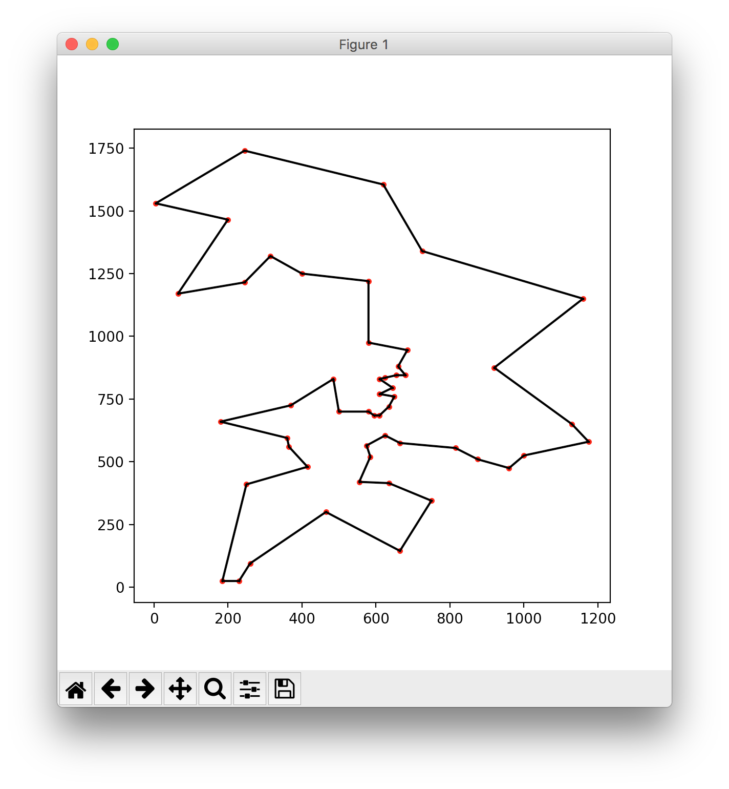
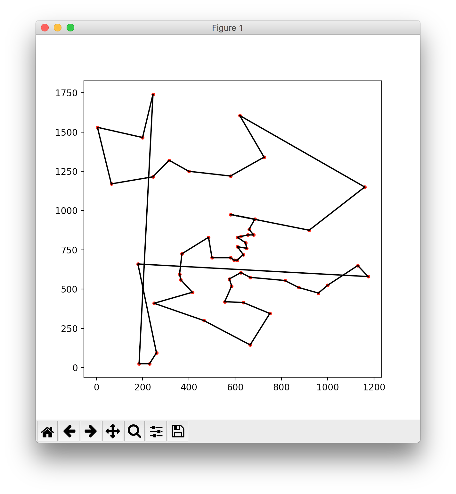

# Topic Sort

## Overview

Suppose you've got a text file where you're gathering ideas for a blog post you're planning to write.  New ideas come to you at random times during the day, and you add them to the end of the file regardless of where they belong within the structure of the essay.  Then when it comes time to write, before composing the first sentence, there's a tedious process of converting your jumble of ideas into an outline.

``topic_sort.py`` is an experiment for automating this process.  You pass the file full of ideas as an argument, and it tries to put the ideas in "topic order", so related ideas appear next to each other.  Then it writes the result to standard out.

## Getting Started

The following Python packages will be needed:

* [numpy](http://www.numpy.org/)
* [nltk](https://www.nltk.org/)
* [simplebloomfilter](https://github.com/dnanhkhoa/simple-bloom-filter)

If you want to do development, you'll also need:

* [matplotlib](https://matplotlib.org/)
* [pytest](https://docs.pytest.org/en/latest/)
* [pycodestyle](https://pypi.org/project/pycodestyle/)

Once you've got the packages, clone this repository and run ``./topic_sort.py my_jumbled_ideas.txt``.  Ideas in the file should be separated by blank lines.  If ``-`` is passed instead of a filename, standard input will be read.

The first run may be slow because nltk resources are being downloaded.

The script will use a "quick and dirty" method to sort the file by default.  If you've got time to spare, use the ``-s`` option for slower, more thorough organization.  Progress will be written to stderr.

## How It Works

``topic_sort.py`` works in two phases.

In the first phase, ``n`` text passages are ingested from the input file.  Then an ``n x n`` similarity matrix is computed, where the ``i, j`` entry corresponds to the estimated similarity between the ``i``th text passage and the ``j``th text passage.  Similarity is estimated by tokenizing and lemmatizing each passage, removing stopwords, and computing ngram overlap using tf-idf weighting.  In future versions, word vectors may be used during this step—perhaps after [semantic extraction](https://github.com/maxwelljohn/siamese-semantic-vectors).

In the second phase, the ``n x n`` similarity matrix is used to find an ordering of the text passages where the pairwise similarity of adjacent passages is maximized.  This is very similar to the [Travelling Salesman Problem](https://en.wikipedia.org/wiki/Travelling_salesman_problem).  Instead of finding a route through all the cities that minimizes the total distance traveled, we aim to find a route through all the text passages which maximizes the sum of similarity scores for adjacent passages.  The main difference is that the route through the text passages isn't a closed loop.

``order_problem.py`` contains base classes that can be used to describe & solve either text passage ordering instances or Travelling Salesman Problem instances (for benchmarking purposes).  These classes track partial solutions internally using numpy arrays.  ``optimizers.py`` contains two algorithms which operate on these base classes: ``greedy`` and ``genetic``.

``greedy`` is the algorithm used by default.  It works by greedily choosing the best available edge at each step.  It's quick, but the results can be sloppy.

``genetic`` is the algorithm used if you pass the ``-s`` or ``--slow`` command line option.  The initial population of solutions is formed randomly.  Then each new generation of solutions is formed by choosing parents from the current population using [tournament selection](https://en.wikipedia.org/wiki/Tournament_selection) and having them [breed](https://en.wikipedia.org/wiki/Genetic_algorithm) to produce a new tour.  During the breeding process, noise is added through mutations.  The mutation rate is tuned automatically, by fitting a linear regression to data from the last 8 generations and choosing a rate which is predicted to result in about [20% of mutations being successful](https://arxiv.org/pdf/1504.03212.pdf).  An [elitist](https://en.wikipedia.org/wiki/Genetic_algorithm#Elitism) variant of the genetic algorithm is employed, where a heap tracks the 20 best solutions ever seen and includes them in each generation.  Finally, a [Bloom filter](https://en.wikipedia.org/wiki/Bloom_filter) helps us avoid exploring the same solutions over and over.



*Benchmarking the genetic algorithm.  After 2000 generations, the optimal solution to [this tour](berlin52.tsp) of 52 locations in the city of Berlin has been found.*



*The greedy algorithm solves the same problem.*

## Development

To run the unit tests:

```
pytest *.py
```

To run the coding style tests:

```
pycodestyle *.py
```

To test the genetic algorithm on a TSP instance:

```
python tsp.py berlin52.tsp
```

The code makes liberal use of assertions to ensure correctness, but the genetic algorithm goes almost twice as fast without them.  Run assertions during development by specifying ``python topic_sort.py`` or ``python tsp.py`` on the command line.  ``./topic_sort.py`` and ``./tsp.py`` will use the shebang line, which has assertions disabled.

## Authors

* **John Maxwell** - [maxwelljohn](https://github.com/maxwelljohn)

## License

This project is licensed under the MIT License—see the [LICENSE.txt](LICENSE.txt) file for details.

## Acknowledgments

* Thanks to Sean Luke for his free online book [Essentials of Metaheuristics](https://cs.gmu.edu/~sean/book/metaheuristics/).
* Thanks to the [Discrete and Combinatorial Optimization group](https://wwwproxy.iwr.uni-heidelberg.de/groups/comopt/) at the University of Heidelberg for their [collection of TSP instances](https://wwwproxy.iwr.uni-heidelberg.de/groups/comopt/software/TSPLIB95/tsp/).
